# ☕ Java Learning Notes

> Personal Java learning repository — handwritten notes converted to markdown summaries with hands-on practice code, organised topic by topic.

<div align="center">

[](https://github.com)
[](https://github.com)
[](https://github.com)
[](https://github.com)

</div>

---

## 🔗 Quick Navigation

| | |
|---|---|
| [📓 Scanned Notebook Pages](#-scanned-notebook-pages) | Thumbnail preview of every topic's handwritten notes |
| [📚 Topics Overview](#-topics-overview) | Quick-link table — notes + code for each topic |
| [📁 Repo Structure](#-repository-structure) | Full folder layout explained |
| [🚀 How to Run](#-how-to-run-practice-files) | Compile and run any Java practice file |
| [🎯 Next Topics](#-next-topics-to-cover) | Upcoming topics checklist |

---

## 📓 Scanned Notebook Pages

_Click any thumbnail below to open the scanned PDF for that topic._

<table>

<tr>

<td align="center" width="33%" valign="top" style="padding:16px 8px;">

<a href="resources/page-01-introduction.pdf">
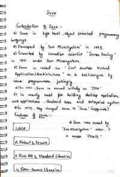
<br/>
<strong>01. Introduction to Java</strong>
</a>
<br/>
<sub>Notebook p. 1 &nbsp;·&nbsp; 1 page</sub>
<br/>
<sub><em>What is Java, history, features, WORA, famous apps</em></sub>
<br/>&nbsp;

</td>

<td align="center" width="33%" valign="top" style="padding:16px 8px;">

<a href="resources/page-02-jvm-jdk-jre.pdf">
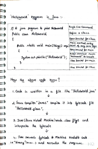
<br/>
<strong>02. JVM / JDK / JRE</strong>
</a>
<br/>
<sub>Notebook p. 3–13 &nbsp;·&nbsp; 11 pages</sub>
<br/>
<sub><em>Architecture, class loader, memory areas, execution engine, JNI</em></sub>
<br/>&nbsp;

</td>

<td align="center" width="33%" valign="top" style="padding:16px 8px;">

<a href="resources/page-03-hello-world.pdf">
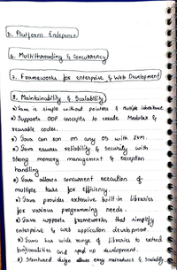
<br/>
<strong>03. Hello World Program</strong>
</a>
<br/>
<sub>Notebook p. 2, 15–20, 63–65 &nbsp;·&nbsp; 10 pages</sub>
<br/>
<sub><em>Class definition, main method, System.out.println, command-line args</em></sub>
<br/>&nbsp;

</td>

</tr>

<tr>

<td align="center" width="33%" valign="top" style="padding:16px 8px;">

<a href="resources/page-04-05-data-types-variables.pdf">
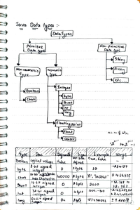
<br/>
<strong>04-05. Data Types &amp; Variables</strong>
</a>
<br/>
<sub>Notebook p. 21–24 &nbsp;·&nbsp; 4 pages</sub>
<br/>
<sub><em>Primitive types, float/double rules, local/instance/static variables</em></sub>
<br/>&nbsp;

</td>

<td align="center" width="33%" valign="top" style="padding:16px 8px;">

<a href="resources/page-06-operators.pdf">
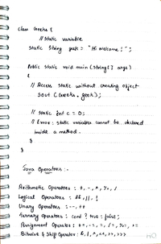
<br/>
<strong>06. Operators</strong>
</a>
<br/>
<sub>Notebook p. 25–33 &nbsp;·&nbsp; 9 pages</sub>
<br/>
<sub><em>Arithmetic, logical, bitwise AND/OR/XOR/shift, instanceof, inc/dec</em></sub>
<br/>&nbsp;

</td>

<td align="center" width="33%" valign="top" style="padding:16px 8px;">

<a href="resources/page-07-keywords-identifiers.pdf">
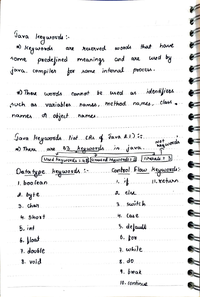
<br/>
<strong>07. Keywords &amp; Identifiers</strong>
</a>
<br/>
<sub>Notebook p. 34–37 &nbsp;·&nbsp; 4 pages</sub>
<br/>
<sub><em>53 reserved words, keyword categories, identifier rules</em></sub>
<br/>&nbsp;

</td>

</tr>

<tr>

<td align="center" width="33%" valign="top" style="padding:16px 8px;">

<a href="resources/page-08-wrapper-classes.pdf">
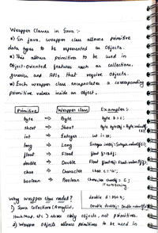
<br/>
<strong>08. Wrapper Classes</strong>
</a>
<br/>
<sub>Notebook p. 38–45 &nbsp;·&nbsp; 8 pages</sub>
<br/>
<sub><em>Autoboxing, unboxing, 14 methods, integer cache, == vs .equals()</em></sub>
<br/>&nbsp;

</td>

<td align="center" width="33%" valign="top" style="padding:16px 8px;">

<a href="resources/page-09-decision-making.pdf">
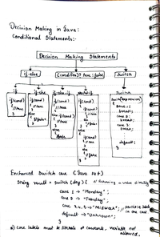
<br/>
<strong>09. Decision Making</strong>
</a>
<br/>
<sub>Notebook p. 46 &nbsp;·&nbsp; 1 page</sub>
<br/>
<sub><em>if/else, if-else-if, nested-if, ternary, switch, enhanced switch</em></sub>
<br/>&nbsp;

</td>

<td align="center" width="33%" valign="top" style="padding:16px 8px;">

<a href="resources/page-10-loops.pdf">
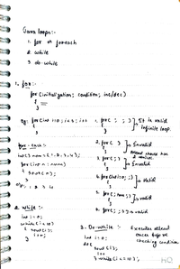
<br/>
<strong>10. Loops</strong>
</a>
<br/>
<sub>Notebook p. 47 &nbsp;·&nbsp; 1 page</sub>
<br/>
<sub><em>for, for-each, while, do-while with examples and valid variants</em></sub>
<br/>&nbsp;

</td>

</tr>

<tr>

<td align="center" width="33%" valign="top" style="padding:16px 8px;">

<a href="resources/page-11-jump-statements.pdf">
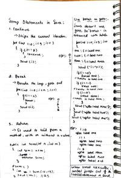
<br/>
<strong>11. Jump Statements</strong>
</a>
<br/>
<sub>Notebook p. 48 &nbsp;·&nbsp; 1 page</sub>
<br/>
<sub><em>continue, break, return, break with labels (goto alternative)</em></sub>
<br/>&nbsp;

</td>

<td align="center" width="33%" valign="top" style="padding:16px 8px;">

<a href="resources/page-12-methods.pdf">
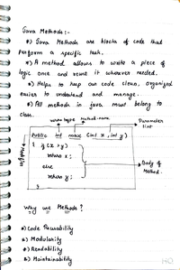
<br/>
<strong>12. Methods</strong>
</a>
<br/>
<sub>Notebook p. 49–57 &nbsp;·&nbsp; 9 pages</sub>
<br/>
<sub><em>Instance vs static, getters/setters, call stack, predefined methods</em></sub>
<br/>&nbsp;

</td>

<td align="center" width="33%" valign="top" style="padding:16px 8px;">

<a href="resources/page-13-access-modifiers.pdf">
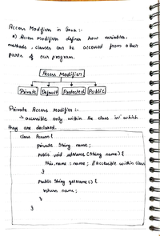
<br/>
<strong>13. Access Modifiers</strong>
</a>
<br/>
<sub>Notebook p. 58–62 &nbsp;·&nbsp; 5 pages</sub>
<br/>
<sub><em>private, default, protected, public — scope rules with examples</em></sub>
<br/>&nbsp;

</td>

</tr>

</table>

---

## 📚 Topics Overview

| # | Topic | Notes | Practice Code | Notebook Pages |
|:-:|-------|:-----:|:-------------:|:--------------:|
| `01` | Introduction to Java | [📄 notes](notes/01-introduction.md) | [💻 code](src/01-basics/) | `p. 1` |
| `02` | JVM / JDK / JRE | [📄 notes](notes/02-jvm-jdk-jre.md) | — | `p. 3–13` |
| `03` | Hello World Program | [📄 notes](notes/03-hello-world.md) | [💻 code](src/01-basics/HelloWorld.java) | `p. 2, 15–20, 63–65` |
| `04` | Data Types | [📄 notes](notes/04-data-types.md) | [💻 code](src/01-basics/DataTypes.java) | `p. 21–22` |
| `05` | Variables | [📄 notes](notes/05-variables.md) | [💻 code](src/02-variables/Variables.java) | `p. 22–24` |
| `06` | Operators | [📄 notes](notes/06-operators.md) | [💻 code](src/03-operators/Operators.java) | `p. 25–33` |
| `07` | Keywords & Identifiers | [📄 notes](notes/07-keywords-identifiers.md) | — | `p. 34–37` |
| `08` | Wrapper Classes | [📄 notes](notes/08-wrapper-classes.md) | [💻 code](src/04-wrapper-classes/WrapperClasses.java) | `p. 38–45` |
| `09` | Decision Making | [📄 notes](notes/09-decision-making.md) | [💻 code](src/05-decision-making/DecisionMaking.java) | `p. 46` |
| `10` | Loops | [📄 notes](notes/10-loops.md) | [💻 code](src/06-loops/Loops.java) | `p. 47` |
| `11` | Jump Statements | [📄 notes](notes/11-jump-statements.md) | [💻 code](src/07-jump-statements/JumpStatements.java) | `p. 48` |
| `12` | Methods | [📄 notes](notes/12-methods.md) | [💻 code](src/08-methods/Methods.java) | `p. 49–57` |
| `13` | Access Modifiers | [📄 notes](notes/13-access-modifiers.md) | [💻 code](src/09-access-modifiers/AccessModifiers.java) | `p. 58–62` |

---

## 📁 Repository Structure

```
java-learning-notes/
├── README.md                          ← you are here
├── PROGRESS.md                        ← topic-by-topic checkbox tracker
│
├── notes/                             ← markdown summaries (13 files)
│   ├── 01-introduction.md
│   ├── 02-jvm-jdk-jre.md
│   ├── 03-hello-world.md
│   └── ... (10 more)
│
├── src/                               ← Java practice code
│   ├── 01-basics/                     HelloWorld.java · DataTypes.java
│   ├── 02-variables/                  Variables.java
│   ├── 03-operators/                  Operators.java
│   ├── 04-wrapper-classes/            WrapperClasses.java
│   ├── 05-decision-making/            DecisionMaking.java
│   ├── 06-loops/                      Loops.java
│   ├── 07-jump-statements/            JumpStatements.java
│   ├── 08-methods/                    Methods.java
│   └── 09-access-modifiers/           AccessModifiers.java
│
└── resources/                         ← scanned notebook PDFs
    ├── thumbnails/                    ← first-page preview PNGs (used by README)
    │   ├── page-01-introduction.png
    │   └── ... (12 PNGs total)
    ├── page-01-introduction.pdf
    └── ... (12 PDFs total)
```

---

## 🚀 How to Run Practice Files

```bash
# navigate to the topic folder
cd src/01-basics

# compile
javac HelloWorld.java

# run
java HelloWorld

# run with command-line arguments
java HelloWorld 10 20 Kishor
```

---

## 🎯 Next Topics to Cover

- [ ] OOP — Classes, Objects, Constructors
- [ ] Inheritance
- [ ] Polymorphism
- [ ] Abstraction & Interfaces
- [ ] Exception Handling
- [ ] Collections Framework
- [ ] Generics
- [ ] File I/O
- [ ] Multithreading

---

<div align="center">

*Notes by HQ &nbsp;·&nbsp; Java learning journey*

</div>